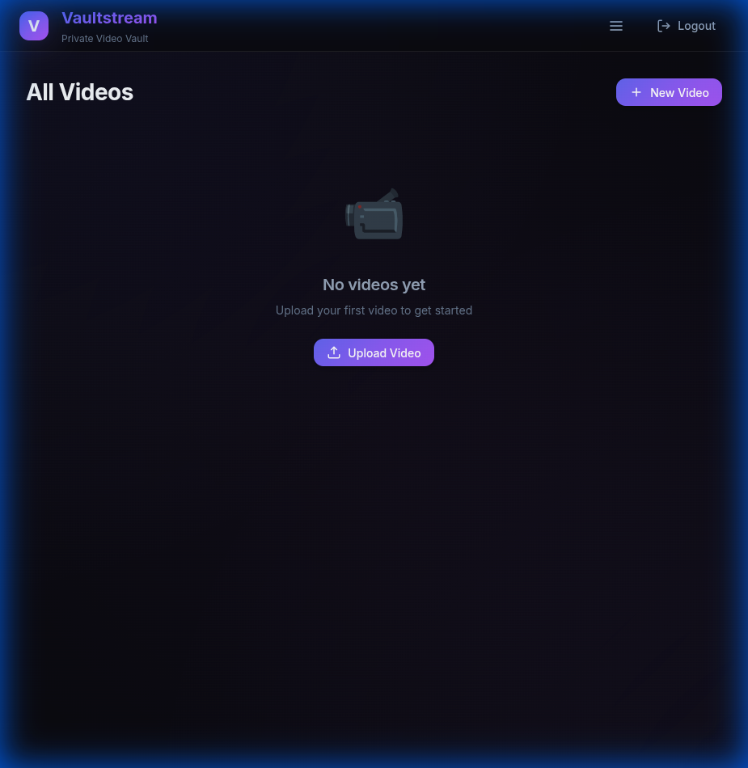
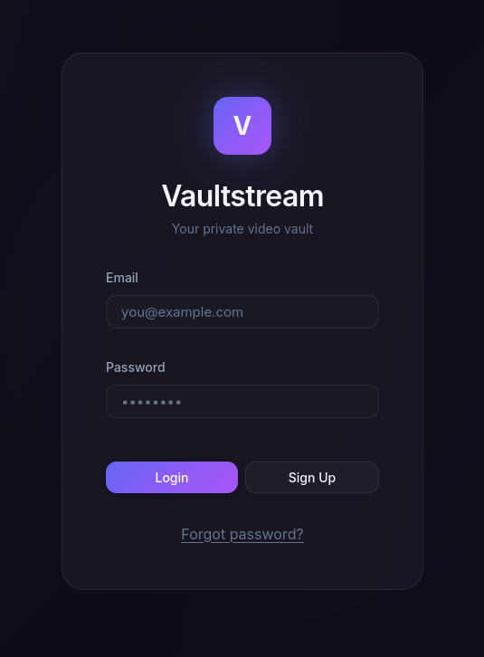
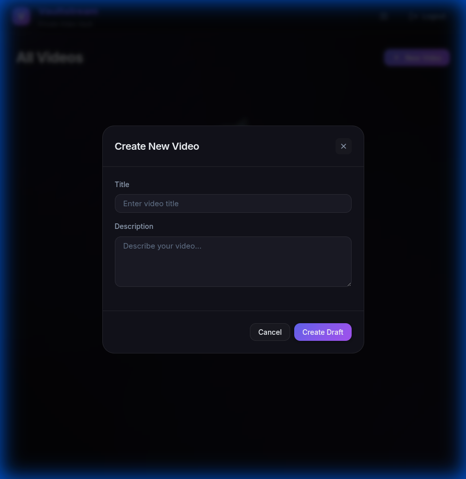

# Vaultstream 🔐

A modern, secure private video vault built with Go, SQLite, and AWS S3. Upload, organize, and stream your personal videos with a beautiful dark-themed interface.



## ✨ Features

- **Secure Video Storage** - Upload and stream videos with presigned URLs
- **Advanced Authentication** - Secure JWT access tokens (15m expiry) with auto-rotating refresh tokens
- **User Profiles** - Registration with full name support
- **Password Reset** - Secure token-based password recovery flow
- **Selective Deletion** - Option to delete only thumbnails or video files, or the entire record
- **Robust Error Handling** - Expired URL detection with auto-refresh capabilities
- **Modern UI** - Premium glassmorphism dark theme with separate viewer and editor modals
- **S3 Integration** - Cloud storage with AWS S3 or local fallback
- **Video Streaming** - HTTP Range requests for smooth playback
- **Drag & Drop Upload** - Modern file upload experience

## 🛠️ Tech Stack

| Component | Technology                         |
| --------- | ---------------------------------- |
| Backend   | Go (Standard Lib + Middleware)     |
| Database  | SQLite3                            |
| Storage   | AWS S3 / Local filesystem          |
| Auth      | JWT (Short-lived) + Refresh Tokens |
| Frontend  | Vanilla HTML, CSS, JavaScript      |

## 🚀 Quickstart

### Prerequisites

- [Go 1.21+](https://go.dev/doc/install)
- [SQLite3](https://www.sqlite.org/download.html)
- [FFMPEG](https://ffmpeg.org/download.html) (for video processing)
- [AWS CLI](https://aws.amazon.com/cli/) (optional, for S3 storage)

### Installation

```bash
# Clone the repository
git clone https://github.com/yourusername/vaultstream.git
cd vaultstream

# Install Go dependencies
go mod download

# Configure environment
cp .env.example .env
# Edit .env with your settings
```

### Environment Variables

```env
DB_PATH=vaultstream.db
JWT_SECRET=your-secret-key
PLATFORM=dev
PORT=8091
FILEPATH_ROOT=./app
ASSETS_ROOT=./assets

# Optional: S3 Configuration
S3_BUCKET=your-bucket-name
S3_REGION=us-east-1
```

### Run

```bash
go run .
```

Open http://localhost:8091/app/ in your browser.

## 📁 Project Structure

```
vaultstream/
├── app/                    # Frontend assets
│   ├── index.html         # Main HTML (Modals, Forms)
│   ├── styles.css         # Modern CSS with glassmorphism
│   └── app.js             # State management & UI logic
├── internal/
│   ├── auth/              # JWT authentication
│   ├── database/          # SQLite operations
│   └── storage/           # S3/Local file storage
├── handler_*.go           # HTTP request handlers
├── middleware.go          # Auth, Logger, CORS, Recovery
├── routes.go              # Route registration
├── main.go                # Application entry point
└── .env                   # Configuration
```

## 🔑 API Endpoints

### Authentication & Users

| Method | Endpoint               | Description                                  |
| ------ | ---------------------- | -------------------------------------------- |
| `POST` | `/api/login`           | User login (returns Access + Refresh tokens) |
| `POST` | `/api/users`           | Create account                               |
| `POST` | `/api/refresh`         | Refresh access token                         |
| `POST` | `/api/revoke`          | Revoke refresh token                         |
| `POST` | `/api/forgot-password` | Request password reset token                 |
| `POST` | `/api/reset-password`  | Reset password using token                   |

### Videos

| Method   | Endpoint                     | Description              |
| -------- | ---------------------------- | ------------------------ |
| `GET`    | `/api/videos`                | List all videos          |
| `GET`    | `/api/videos/:id`            | Get video details        |
| `POST`   | `/api/videos`                | Create video draft       |
| `PUT`    | `/api/videos/:id`            | Update video details     |
| `DELETE` | `/api/videos/:id`            | Delete video (all files) |
| `DELETE` | `/api/videos/:id/thumbnail`  | Delete thumbnail only    |
| `DELETE` | `/api/videos/:id/video-file` | Delete video file only   |

### Uploads

| Method | Endpoint                    | Description       |
| ------ | --------------------------- | ----------------- |
| `POST` | `/api/video_upload/:id`     | Upload video file |
| `POST` | `/api/thumbnail_upload/:id` | Upload thumbnail  |

## 🎨 Screenshots

### Login Page



### Video Viewer & Editor



## 🐳 Docker (Optional)

```bash
# Build
docker build -t vaultstream .

# Run
docker run -p 8091:8091 -v $(pwd)/data:/app/data vaultstream
```

## 📄 License

MIT License - feel free to use this project for learning or personal use.

---

Built with ❤️ using Go and modern web technologies.
